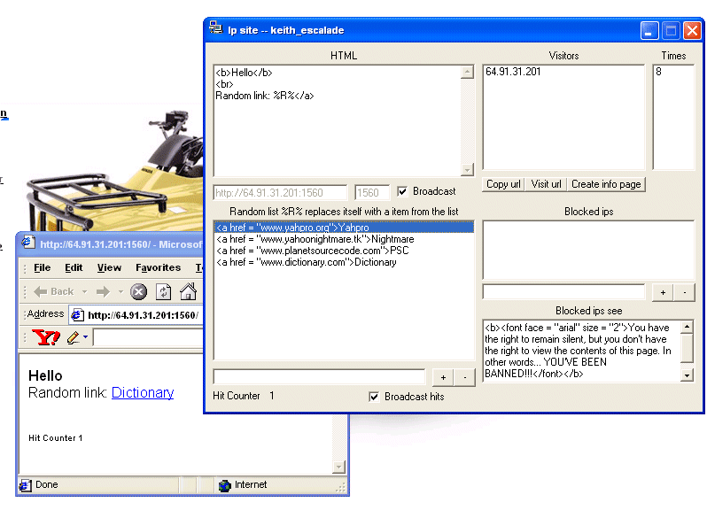



## I\.P\. Site

### Description

With this, you'll be able to host your own HTML/text. Features include: Ip blocker to prevent lag, blocked ip text, random list, hit counter, visitor monitor and the number of times they visited, port chooser, and an info page creator to tell a little about yourself.
 
### More Info
 

             |
---                |---
**Submitted On**   |2003-02-12 16:48:38
**By**             |[keith\_escalade](https://github.com/Planet-Source-Code/PSCIndex/blob/master/ByAuthor/keith-escalade.md)
**Level**          |Intermediate
**User Rating**    |5.0 (50 globes from 10 users)
**Compatibility**  |VB 6\.0
**Category**       |[Internet/ HTML](https://github.com/Planet-Source-Code/PSCIndex/blob/master/ByCategory/internet-html__1-34.md)
**World**          |[Visual Basic](https://github.com/Planet-Source-Code/PSCIndex/blob/master/ByWorld/visual-basic.md)
**Archive File**   |[I\_P\_\_Site15431321220\.zip](https://github.com/Planet-Source-Code/keith-escalade-i-p-site__1-43154/archive/master.zip)

